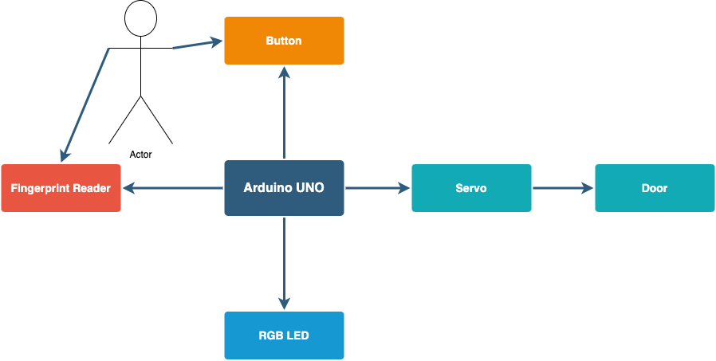
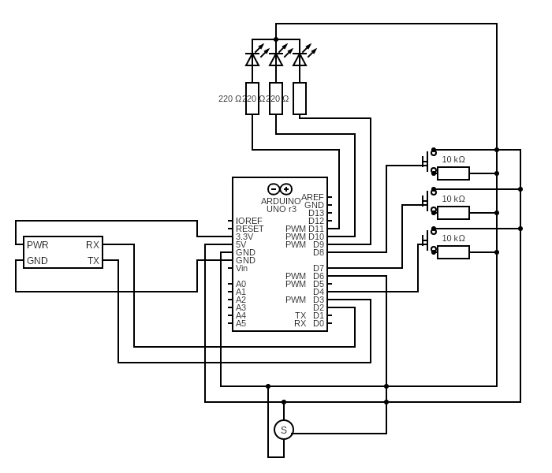
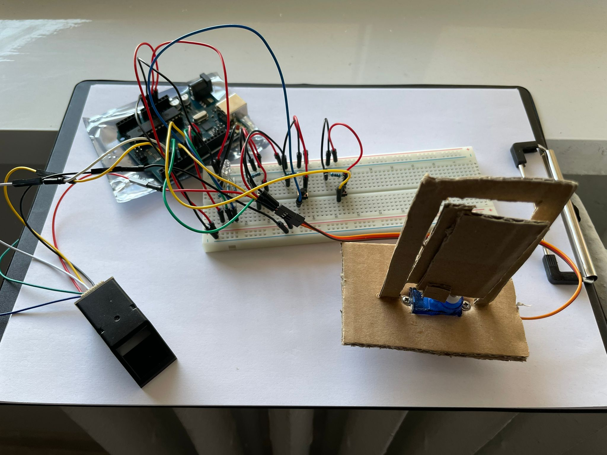
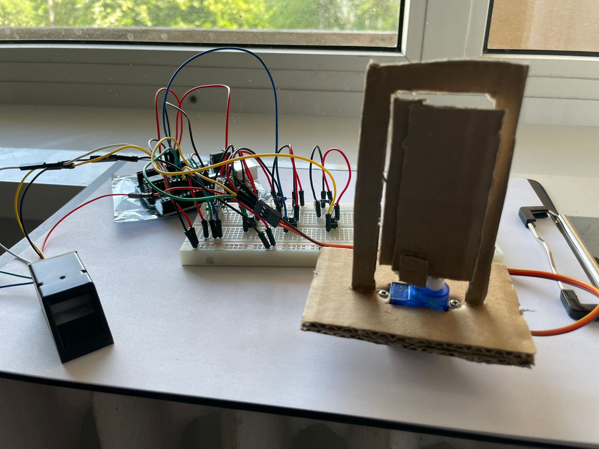

# Fingerprint Smart Lock

## Introducere

Acest proiect implementeaza o incuietoare inteligenta cu verificare biometrica. Aceasta incuietoare se bazeaza pe citirea unei amprente si verificarea acesteia cu o amprenta preconfigurata pentru a determina daca utilizatorul poate sau nu sa deschida o usa.

Scopul proiectului este de a oferi o implementare cu securitate sporita pentru un produs foarte predominant in vietile noastre. Acest tip de securitate ofera un nivel ridicat de siguranta si pace utilizatorilor sai, asigurand faptul ca usile ce folosesc acest produs vor putea fi deschise doar de cine trebuie.

Idee de baza a proiectului a fost crearea unui sistem de incuietoare mai sigur si mai facil, ce nu necesita posesia unui obiect auxiliar pentru deschidere si care se foloseste de unul sau mai multi factori biometrici, ceva ce avem mereu in posesia noastra.

Acest produs este util deoarece poate inlocuii incuietorile clasice pe baza de cheie sau card su unele mai sigure si mai usor de utilizat.

## Descriere generală

Initial, cat timp o amprenta de verificare nu este configurata, LED-ul RGB se va aprinde intermitent cu culoarea galben pentru a semnifica acest lucru. Utilizatorul poate apasa butonul pentru a incepe configurarea. Mai apoi acesta va fi nevoit sa puna degetul pe cititorul de amprenta pentru a inregistra amprenta. Dupa inregistrare cu succes, LED-ul se va aprinde verde pentru scurt timp iar mai apoi se va colora in rosu pentru a semnifica faptul ca usa este inchisa. Pentru a deschide usa, utilizatorul va trebui sa apese butonul si sa puna degetul pe cititorul de amprenta. In caz de succes, LED-ul se va face verde iar usa se va deschide. LED-ul ramane verde cat timp usa este deschisa. La urmatoarea apasare a butonului, usa se va inchide iar LED-ul se va face rosu. In caz de eroare la autentificare, LED-ul ramane rosu iar usa ramane inchisa.

## Hardware Design

### Lista de piese

Acestea sunt piesele ce vor fi utilizate in implementarea proiectului:

* Arduino UNO R3 (placa compatibila)
* Breadboard
* Buton x 3
* LED RGB
* Servomotor
* Cititor de amprente compatibil Arduino
* Fire x 20
* Rezistente → 3 x 220Ω, 3 x 10kΩ

### Diagrama Electrica

## Software Design

* Mediu de dezvlotare utilizat: Arduino IDE
* Librării şi surse 3rd-party utilizate: [Adafruit Fingerprint Sensor Library](https://github.com/adafruit/Adafruit-Fingerprint-Sensor-Library) si functii preluate din exemplele de cod puse la dispozitie de aceasta librarie.

### Descrierea Implementarii

Pentru a interactiona cu Cititorul de Amprenta am utilizat libraria [Adafruit Fingerprint Sensor Library](https://github.com/adafruit/Adafruit-Fingerprint-Sensor-Library) si am utilizat exemplele de cod oferite impreuna cu aceasta librarie pentru a prelua implementarea functionalitatilor de inregistrare de amprenta, de verificare de amprenta si de resetare a amprentelor stocate.

De asemenea am mai utilizat si libraria Servo oferita de Arduino pentru a interactiona cu servomotorul si libraria Serial oferita de Arduino pentru a afisa mesaje de debug si de eroare.

Functionalitatea proiectului se bazeaza pe utilizarea celor 3 butoane si a cititorului de amprenta. Utilizatorul are un buton pentru inchiderea si deschiderea usii, unul pentru adaugare de noi amprente si unul pentru resetarea amprenetlor stocate. Initial, sau dupa o resetare, cand nu exista nicio amprenta configurata, functionalitatea butonului de inchidere/deschidere devine la fel cu cea a butonului de inregistrare a unei amprente, utilizatorul fiind nevoit sa isi inregistreze o amprenta inainte sa poata deschide sau inchide usa. Operatiile sunt acompaniate de un LED RGB a le carui culori exprima starea curenta a sistemului:

* Rosu → eroare/usa inchisa
* Verde → succes/usa deschisa
* Albastru → in asteptarea unei amprente
* Galben Intermitent → functionalitate dezactivata, nu exista nicio amprenta configurata

Deschiderea sau inchiderea usii se realizeaza prin actionarea servo-ului conectat la usa, in urma detectarii unei amprente corecte sau a apasarii butonului pentru inchidere.

## Rezultate Obţinute

### Poze

### Demo

[Demo on YouTube](https://youtu.be/tzV3e4ldFP0)

## Concluzii

In urma acestui proiect am descoperit cum pot fi implementate in mod rapid si usor diverse sisteme electrice de dimensiuni reduse, utile in viata de zi cu zi, prin intermediul Arduino Uno.

## Download

Codul se poate obtine din cadrul acestui repository.

## Jurnal

* 02.05.2022 - Alegere tema proiect
* 09.05.2022 - Completare milestone 1 cu introducere, schema bloc, lista de componente si comandat piesele necesare
* 10.05.2022 - Primire componente si inceperea planificarii implementarii proiectului
* 21.05.2022 - Finalizare implementare hardware si software
* 22.05.2022 - Adaugare suport vizual printr-o usa de carton care se va deschide
* 23.05.2022 - Finalizare documentatie

## Bibliografie/Resurse

* [Adafruit Fingerprint Sensor Library](https://github.com/adafruit/Adafruit-Fingerprint-Sensor-Library)
* [Exemplu de conectare cititor de amprenta - Arduino Uno](https://ardushop.ro/ro/home/1489-fingerprint-reader.html)
* [Arduino Servo](https://www.arduino.cc/reference/en/libraries/servo/)
* [Arduino RGB LED](https://create.arduino.cc/projecthub/muhammad-aqib/arduino-rgb-led-tutorial-fc003e)
* [Arduino Button](https://www.arduino.cc/en/Tutorial/BuiltInExamples/Button)
* [Laborator 2 PM](https://ocw.cs.pub.ro/courses/pm/lab/lab2-2022)
* [Laborator 3 PM](https://ocw.cs.pub.ro/courses/pm/lab/lab3-2022)
